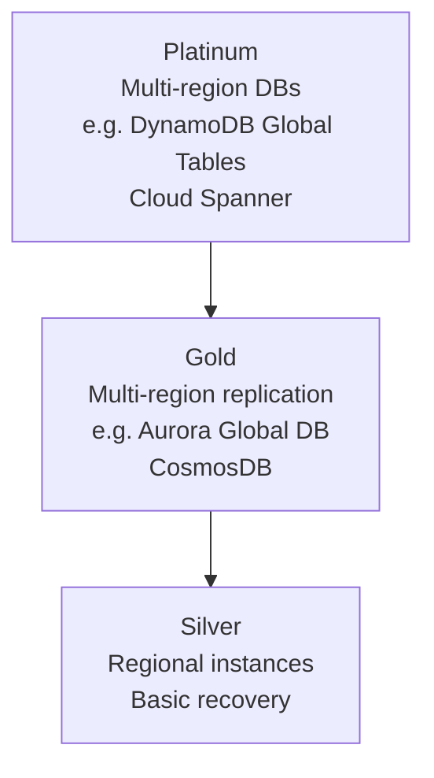
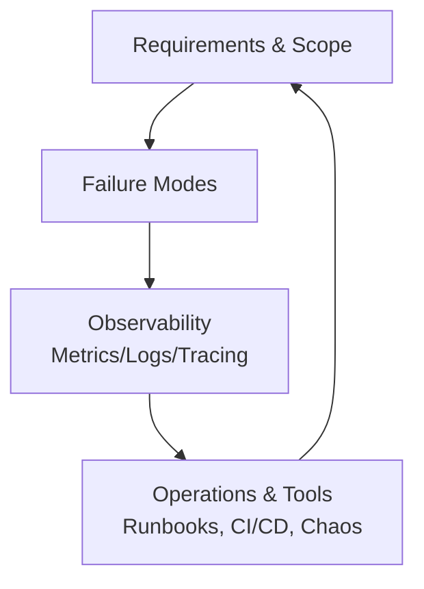
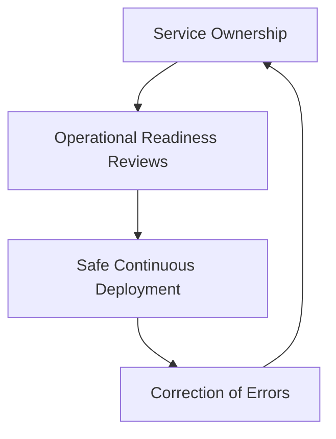

## 🔹 Resilience Lifecycle  

A repeatable process to embed resilience in every workload:  

1. **Set Objectives** → Define critical apps, user stories, and resilience metrics.  
2. **Design & Implement** → Understand dependencies, build DR strategies, CI/CD, safe failure.  
3. **Evaluate & Test** → Load testing, DR drills, chaos engineering, synthetic testing.  
4. **Operate** → Continuous monitoring, observability, event management.  
5. **Respond & Learn** → Incident reviews, training, metrics reviews, and knowledge base building.  

**Action:**  
Turn this into a cycle — after each release or incident, revisit objectives, test, and improve.  

---

## 🔹 Resilience Tiers  

Resilience is not one-size-fits-all. Workloads should be mapped to clear targets:  

- **Silver (99.95%)** → Standard business systems.  
  - RTO: 24 hrs | RPO: 12 hrs  
- **Gold (99.99%)** → Business-critical or security systems.  
  - RTO: 1 hr | RPO: 30 min  
- **Platinum (99.995%)** → Critical infrastructure / national-scale systems.  
  - RTO: 15 min | RPO: 1 min  

**Action:**  
Map each workload to a tier. Don’t overspend on Platinum for apps that only need Silver.  

---

## 🔹 Architectural Patterns  

Proven approaches to withstand failure:  

**Key Questions:**  
- How will the system handle **load spikes**?  
- How do we detect and recover from **data corruption**?  
- How do we prepare for **gray failures** (partial degradation)?  

**Action:**  
Choose patterns that match the assigned tier. Build runbooks for load, database, and service failure scenarios.  

---

## 🔹 Building a Resilience Strategy  

A complete strategy includes:  

**Action:**  
Document a resilience playbook for each workload with failure modes, observability dashboards, and operational runbooks.  

---

## 🔹 Operational Practices  

Resilience is a culture as much as a design:  

- **Service Ownership** → Teams own reliability end-to-end.  
- **Safe Continuous Deployment** → Automate to reduce risk.  
- **Correction of Errors (CoE)** → Root cause analysis and prevention.  
- **Operational Readiness Reviews (ORR)** → Validate resilience before launch.  

**Action:**  
Make ORRs, CoEs, and service ownership standard rituals across teams.  
