# Fault Isolation – Core Concepts

---

## 🔹 Control Plane vs Data Plane
- **Control Plane**:  
  - Create, update, delete, list resources.  
  - Complex orchestration, many dependencies.  
  - Lower volume.  
- **Data Plane**:  
  - Executes day-to-day business of the resource.  
  - Simpler, fewer dependencies.  
  - Higher volume.  

**Action:** Architect workloads to **rely on the data plane**, not continuous control plane availability.  

---

## 🔹 Example: EC2
- **Control Plane**: launching new EC2 instances.  
- **Data Plane**: running EC2 instances.  

**Action:** Design for EC2 workloads to **keep running if the control plane is unavailable**.

---

## 🔹 Additional Service Examples
| Service   | Control Plane Actions               | Data Plane Actions              |
|-----------|-------------------------------------|---------------------------------|
| S3        | CreateBucket, PutBucketPolicy       | GetObject, PutObject            |
| DynamoDB  | CreateTable, UpdateTable            | GetItem, PutItem, Scan, Query   |
| ELB       | CreateLoadBalancer, CreateTargetGrp | Load balancer traffic           |
| Route 53  | CreateHostedZone, UpdateResourceSet | DNS resolution, health checks   |
| IAM       | CreateRole, CreatePolicy            | AuthN/AuthZ                     |
| RDS       | CreateDatabaseInstance              | DB queries                      |

**Action:** Map your services into **CP vs DP operations**. Depend on **DP ops** for resiliency.  

---

## 🔹 Failure Likelihood
- CP is more complex → fails more often.  
- DP is simpler → less failure-prone.  

**Action:** Expect **control plane disruptions**. Build apps so DP continues.  

---

## 🔹 Criticality
- **More critical:** Data plane.  
- Because it runs the **day-to-day business logic**.  

**Action:** Protect data plane availability above all else.  

---

## 🔹 Unchaining Availability
- CP outages should not break workloads.  
- DP maintains existing state independently.  

**Action:** **Decouple workloads** from CP during steady-state operations.  

---

## 🔹 Data Plane Maintains State
- CP pushes config → DP.  
- DP continues running even if CP unavailable.  

**Action:** Limit **real-time reliance on CP**. Push config early, then run steady.  

---

## 🔹 CP vs DP Takeaways
- CP = more dependencies, more likely to fail.  
- DP = better dependency for resilience.  
- Separation unchains availability domains.  

**Action:** Always **prefer DP dependencies** when architecting.  

---

## 🔹 Static Stability
- System can keep operating **without changes** during dependency outages.  
- Dependency ≠ Destiny → you’re not forced to fail just because a dependency did.  

**Action:** Design for **steady-state survivability**. 

---

## 🔹 Static Stability Approaches
- Prevent circular dependencies.  
- Pre-provision capacity/resources.  
- Maintain state locally.  
- Eliminate synchronous dependencies (replace with async/indirect sync).  

**Action:** Adopt async + pre-provisioning to survive dependency failures.  

---

## 🔹 Static Stability Example
- Synchronous dependencies multiply downtime risk.  
- Asynchronous dependencies reduce cascading failures.  

**Action:** Replace synchronous calls with asynchronous patterns for resilience.  

---

## 🔹 EC2 Dependency ≠ Destiny
- Even if the **EC2 control plane** fails, running instances (data plane) keep working.  

**Action:** Assume **data plane survival** in your recovery design.  

---

## 🔹 Lambda Dependency ≠ Destiny
- Lambda depends on EC2, but uses **warm pools** of instances to reduce cold start risk.  

**Action:** Use warm pools, buffers, or caching layers to decouple from single dependencies.  

---

## 🔹 EC2 Anti-Pattern
❌ One Auto Scaling group stretched across multiple AZs → shared failure risk.  

**Action:** Never stretch a single scaling group across AZs.  

```mermaid
flowchart TD
  SG[One Scaling Group] --> AZ1[AZ1]
  SG --> AZ2[AZ2]
  SG --> AZ3[AZ3]
  note[If SG fails → All AZs impacted ❌]
```

---

## 🔹 EC2 Best Practice
✅ Separate scaling groups per AZ, with distribution across multiple regions.  

**Action:** Architect **independent scaling capacity per AZ**.  

```mermaid
flowchart TD
  SG1[Scaling Group AZ1] --> AZ1[AZ1]
  SG2[Scaling Group AZ2] --> AZ2[AZ2]
  SG3[Scaling Group AZ3] --> AZ3[AZ3]
  note[Failure in one AZ does not cascade ✅]
```

---

## 🔹 DNS Serve-Stale (RFC 8767)
- Recursive resolvers return cached results when authoritative DNS is unavailable.  
- Adds resilience against outages and DoS attacks.  

**Action:** Enable **Serve-Stale DNS** where supported to maintain service continuity.  

---

## 🔹 Static Stability Takeaways
- Operate normally in a **static state** during dependency outages.  
- Remove real-time reliance on control planes.  
- Use data plane + pre-provisioning for recovery.  

**Action:** Build fallback paths that work even if dependencies are down.  

---

## 🔹 Availability Zone Independence (AZI)
- Each AZ has its own **control plane + data plane**.  
- Regional services rely on multiple AZs, but workloads should run AZ-local when possible.  

**Action:** Deploy across **independent AZs** to avoid shared-fate failures.  

---

## 🔹 Customer AZI Example
- Web + DB spread across 3 AZs.  
- Aurora primary in one AZ, replicas in others.  
- Network Load Balancers distribute traffic.  

**Action:** Always **spread critical resources across multiple AZs**.  

---

## 🔹 AZI Takeaways
- Easier to **evacuate workloads** from a failing AZ.  
- Isolates impact of single-AZ failures.  
- Improves **performance** and is **cost-effective**.  

**Action:** Build DR and scaling plans that assume **per-AZ isolation**.  

---

## 🔹 Regional Services
- Some AWS services are **region-scoped** (not AZ-scoped).  
- Example: S3, DynamoDB → built-in regional fault tolerance.  

**Action:** Know which services are **regional vs. AZ-bound** and design accordingly.  

---

## 🔹 Fault Isolation Recap
- Separate **control vs data planes**.  
- Use **data plane** for resilience.  
- Apply **static stability**: survive without changes.  
- Exploit **AZI** for stronger fault boundaries.  
- Combine with **regional services** for end-to-end resilience.  

**Action:** Architect for **layered isolation**: DP > AZ > Region.  
