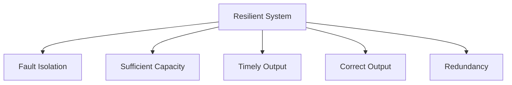
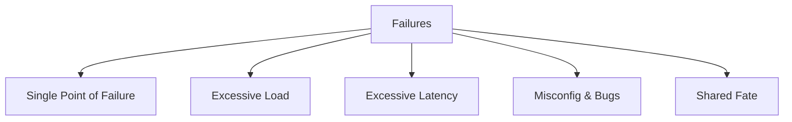
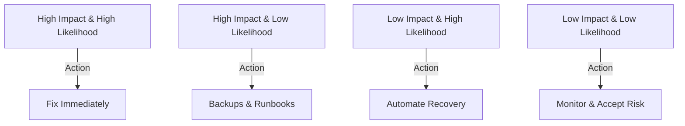
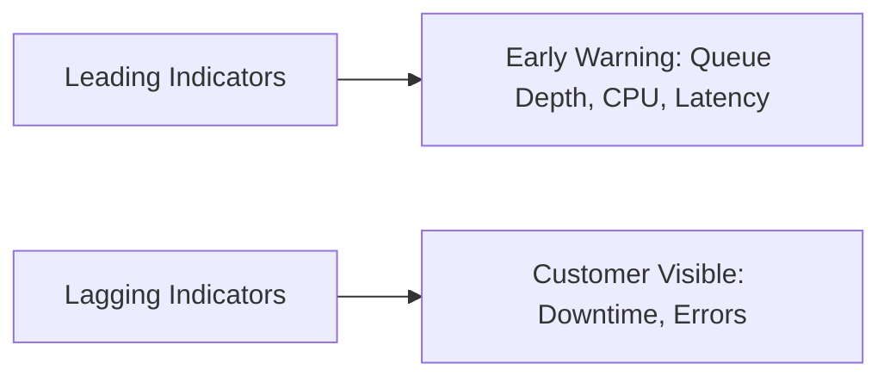
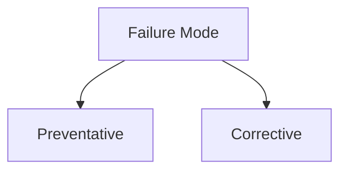
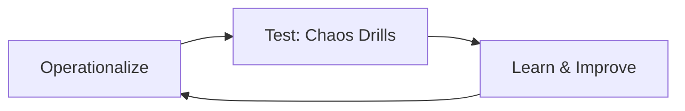

# Resilience Analysis Framework  

A repeatable standard to assess applications and guide strategies for preventing, mitigating, and recovering from failures.  

---

## 🔹 Why Use This Framework?  
- Apply a **repeatable standard** to assess resilience.  
- Guide recovery-oriented strategies for preventing, mitigating, and recovering from failures.  
- Build both **preventative and corrective controls**.  
- Ensure **observability aligns** with resilience strategy.  

---

## 🔹 Desired Resilience Properties  
- **Fault Isolation** → Prevent cascading failures.  
- **Sufficient Capacity** → Scale workloads under load.  
- **Timely Output** → Meet SLA response times.  
- **Correct Output** → Ensure accurate results.  
- **Redundancy** → Replication, failover, backups.  

**Action:** Validate all systems against these five core properties.  

---

## 🔹 Categories of Failure (SEEMS)  
1. **Single Points of Failure** → No redundancy.  
2. **Excessive Load** → Not enough capacity/resources.  
3. **Excessive Latency** → Requests not completing on time.  
4. **Misconfiguration & Bugs** → Incorrect execution.  
5. **Shared Fate** → Violated fault isolation (e.g., noisy neighbors).  

**Action:** Map each workload against SEEMS → design mitigation for each category.  

---

## 🔹 Analysis Maturity  
- **Beginning** → Component-level checks only.  
- **Application** → End-to-end workload analysis.  
- **Advanced** → Full **user journey** evaluation.  

**Action:** Mature resilience testing from components → to workloads → to user journeys.  

---

## 🔹 What Are We Analyzing?  
- End-to-end **workload architectures** (e.g., mobile in-app purchase flow).  
- Includes API gateways, databases, event-driven services, and external dependencies.  

**Action:** Always test user-visible flows, not just infrastructure pieces.  

---

## 🔹 Common Components to Assess  
- **Code & Config** → CI/CD, IaC, deployment pipelines.  
- **Infrastructure** → Compute, network, storage.  
- **Data Stores** → Databases, replication, caching.  
- **External Dependencies** → APIs, SaaS, partner systems.  

**Action:** Maintain a resilience checklist for each category.  

---

## 🔹 Resilience Trade-offs  
- **Cost & Effort** → More resilience costs more.  
- **Complexity** → Multi-region = harder to manage.  
- **Operational Burden** → More monitoring, DR drills.  
- **Consistency & Latency** → Trade-offs in distributed systems.  

**Action:** Weigh designs based on *likelihood × impact*.  

---

## 🔹 Weighing Trade-offs  
- **High Impact + High Likelihood** → Must fix immediately.  
- **High Impact + Low Likelihood** → Backups/runbooks.  
- **Low Impact + High Likelihood** → Automate recovery.  
- **Low Impact + Low Likelihood** → Monitor, accept risk.  

**Action:** Use a risk matrix to prioritize investments.  

---

## 🔹 Failure Mode Observability  
- **Leading Indicators** → Early warnings (queue depth, CPU, latency trends).  
- **Lagging Indicators** → Customer-visible issues (downtime, failed requests).  

**Action:** Instrument for both — catch failures before users see them.  

---

## 🔹 Failure Mode Mitigations  
- **Preventative** → Capacity planning, failover, chaos testing.  
- **Corrective** → Incident response, runbooks, rollback, hotfix.  

**Action:** Pair each failure mode with preventative + corrective controls.  

---

## 🔹 Continuous Improvement  
- **Operationalize** → Schedule resilience reviews and DR tests.  
- **Test** → Regular chaos drills and synthetic failure injection.  
- **Learn** → Post-incident reviews, update playbooks.  

**Action:** Treat resilience as an iterative lifecycle, not one-time design.  

---

## 🔹 Key Takeaways  
- Resilience = **prevent, mitigate, recover**.  
- The framework goes beyond traditional architecture → more **holistic analysis**.  
- Build a **toolbox**:  
  - Identify **failure modes**  
  - Create **observability**  
  - Define **mitigations**  
- Continuous improvement is essential.  

**Action:** Embed this framework into project reviews, DR planning, and system design docs.  
